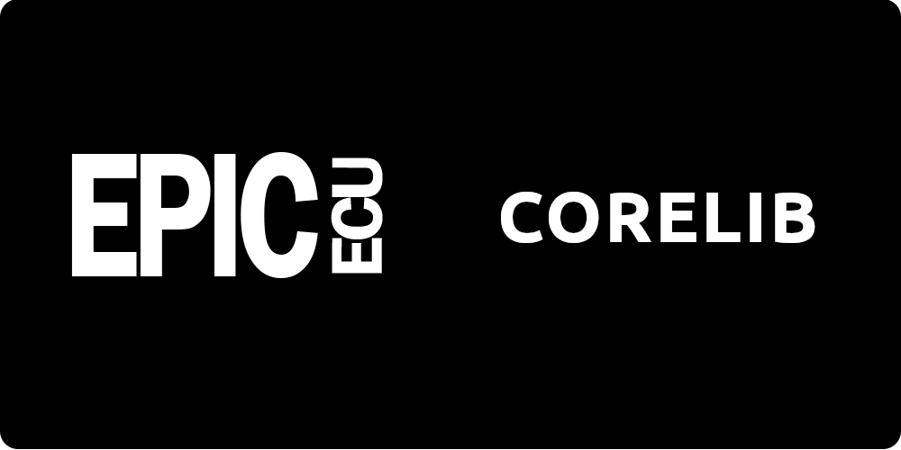

##### Corelib is an open source building block for embedded Teensy projects compatible with the Programmor tuning software.

## Corelib
Corelib is an open source building block designed for embedded projects. It offers header-only libraries written in C++, providing seamless compatibility with the Programmor tuning software. With its focus on USB-HID communication and future support for CANbus and Ethernet, Corelib is based on the Arduino framework and specifically optimized for ARM-based Teensy development boards.

Libraries
- Function.h - Base component for embedded functional tasks
- Comm.h - Base component for communication methods
- Usb.h - USB-HID communications implementation
- Frame.h - Communications data wrapper and protocol

## Documentation
To be complete..

